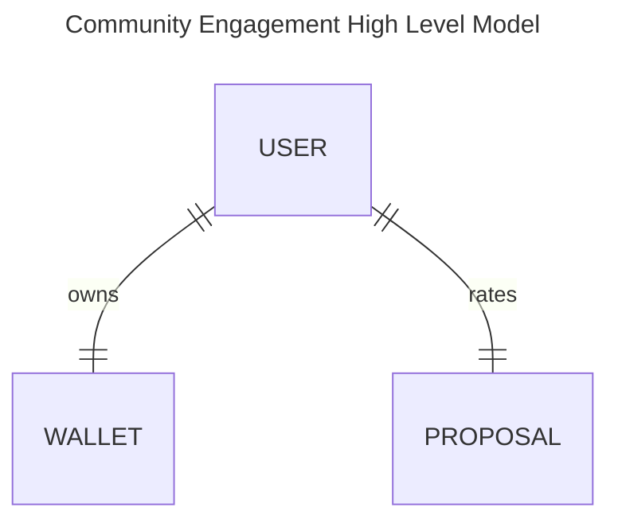
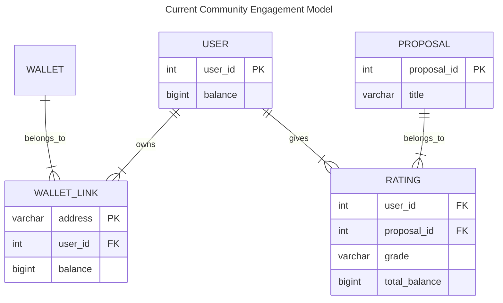
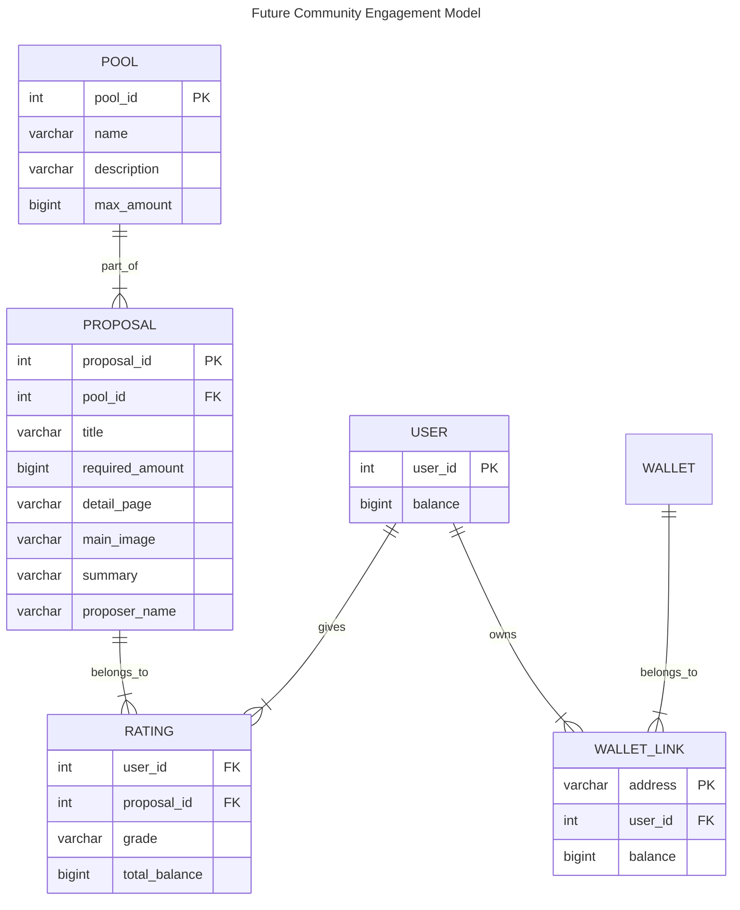

# Community Engagement Score

# System Overview

<div align="center" style="background-color:white">
    
    <p>
        System context overview - <a target="__blank" href="docs/images/system_overview.drawio">source</a>
    </p>
</div>

# Project Structure
* The model structure is inspired by dbt's [How we structure our dbt projects](https://docs.getdbt.com/best-practices/how-we-structure/1-guide-overview) article.

# Data Model
Data model using [Crow's_foot_notation](https://en.wikipedia.org/wiki/Entity%E2%80%93relationship_model#Crow's_foot_notation)


* **users.csv** (collections) - user in the voting portal
* **wallet-links.csv** - [join table] between user and wallet
* **answers.csv** (voting-portal) - [join table] contains answers (ratings) of questions
* **questions.csv** - proposal names






files:
```markdown
# TODO:
* integration available export

# Voting Portal
## voters.csv
Voters in the voting portal and when they joined the voting portal
`voter_id, created_at`

## pools.csv
Bucket of funds allocated for a particular category or theme
`pool_id, pool_name, max_amount_per_pool_usd, pool_description, start_date, end_date`

## proposals.csv
Proposals applying for a certain pool
`proposal_id, pool_id, proposer_id, project_title, total_amount_required, proposal_detail_link, proposal_image_link, project_summary, created_at, updated_at`

# Contract creation and milestone approval workflow
## projects.csv
A project represents a proposal that has been approved and is being executed
`project_id, proposer_id, pool_id, project_title, project_summary, total_amount_required_usd, proposal_detail_link, created_at, updated_at`

## proposers.csv
Information about the proposer
`proposer_id, proposer_name, proposer_role, proposer_email, company_legal_name`

## milestones.csv
Milstones of a project that need to be approved to release funds
`milestone_id, project_id, milestone_name, milestone_description, milestone_deliverable, milestone_amount_usd, created_at, updated_at`

-- additional columns that need to be added manually:
`company_country, company_address, receiving_wallet_address`

# Wallet Linking Tool

## wallets.csv
Wallets (agix or others) and their balance at a given point in time
`wallet_id, type, balance, valid_from, valid_to`

## vallet_links.csv
Link between voter from the voting portal and wallet
`voter_id, wallet_id`

# Reputation and contribution score

## comments.csv
Comments on projects
`comment_id, project_id, created_by, created_at, update_at`

## peer_reviews.csv
Scores given by peers to a project
`project_id, proposer_id, score, created_at, updated_at`

## community_reviews.csv 
Scores given by the community to a project
`project_id, voter_id, created_at, average_score`

## reactions.csv
Contains upvotes and downvotes of comments and reviews

`comment_id, reaction, submitted_by`

## submitted_proposals.csv
`proposer_id, project_id, team_member_ids, awarded, status`

> ❓ this file is not so clear
> ❓ What is the difference between proposer_id and team_member_ids?


```

# Square Root Voting Formula:
Formula used in the report task `make report` to calculate the average grade of a proposal (see `report.sql`).

$\text{Average Grade} = \frac{\sum (\sqrt{\text{tokens}_i} \times \text{grade}_i)}{\sum \sqrt{\text{tokens}_i}}$

Where:
* $tokens_i$: Number of tokens held by user $i$.
* $grade_i$: Grade assigned by user $i$
