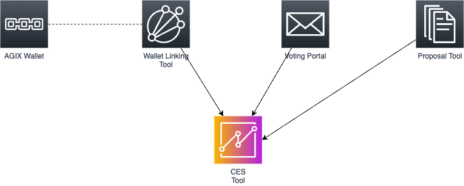
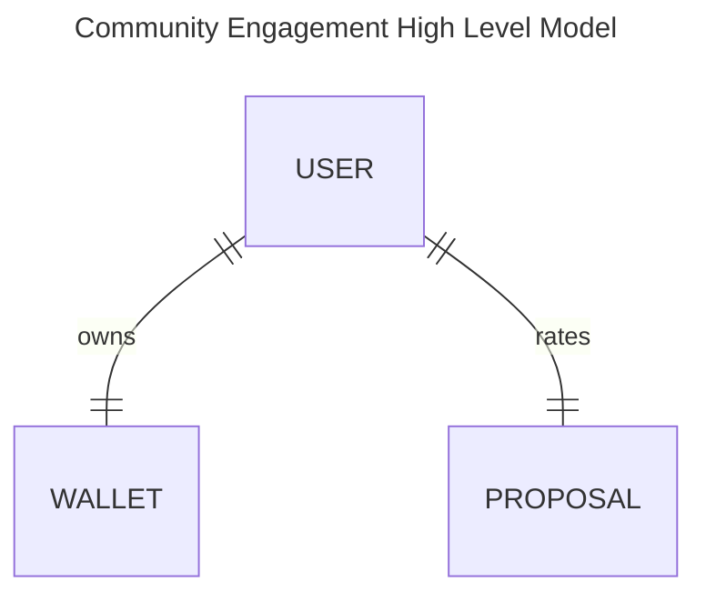
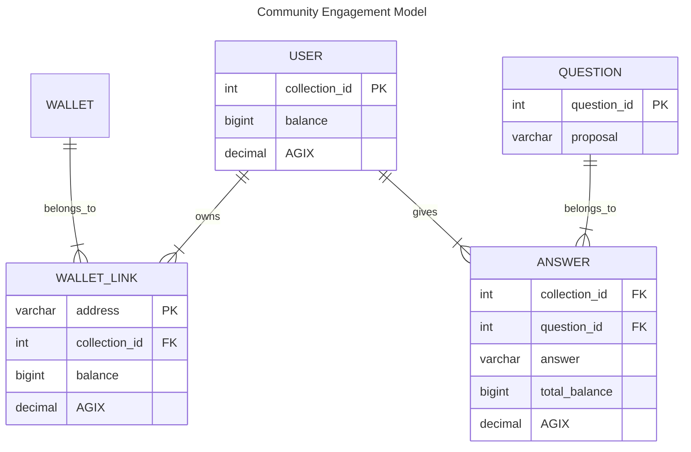

# Community Engagement Score

# Setup
* Install DuckDB `brew install duckdb`
* Install pipenv `brew install pipenv`
* Install nvm `brew install nvm`
* Install dependencies `make setup`
* Place the data in the `data` folder (not included in the repo, but you can download it from [here](https://docs.google.com/spreadsheets/d/1S8AGK7ffVEu9La73yrv9BKlPMvocq9w1RPCjPrn1w6Q/edit#gid=706641192))
    * `answers.csv`
    * `questions.csv`
    * `users.csv`
    * `wallet-links.csv`
* Run dbt transformations `make transfrom`
* Inspect data using `make db`
* Inspect documentation `make docs`

# System Overview

    
    

        System context overview - <a target="__blank" href="docs/images/system_overview.drawio">source</a>
    

# Data Model
Data model using [Crow's_foot_notation](https://en.wikipedia.org/wiki/Entity%E2%80%93relationship_model#Crow's_foot_notation)

* **users.csv** (collections) - user in the voting portal
* **wallet-links.csv** - [join table] between user and wallet
* **answers.csv** (voting-portal) - [join table] contains answers (ratings) of questions
* **questions.csv** - proposal names

# Square Root Voting Formula:
Formula used in the report task `make report` to calculate the average grade of a proposal (see `report.sql`).

$\text{Average Grade} = \frac{\sum (\sqrt{\text{tokens}_i} \times \text{grade}_i)}{\sum \sqrt{\text{tokens}_i}}$

Where:
* $tokens_i$: Number of tokens held by user $i$.
* $grade_i$: Grade assigned by user $i$
