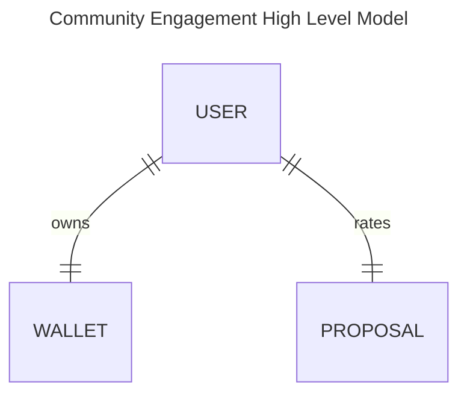
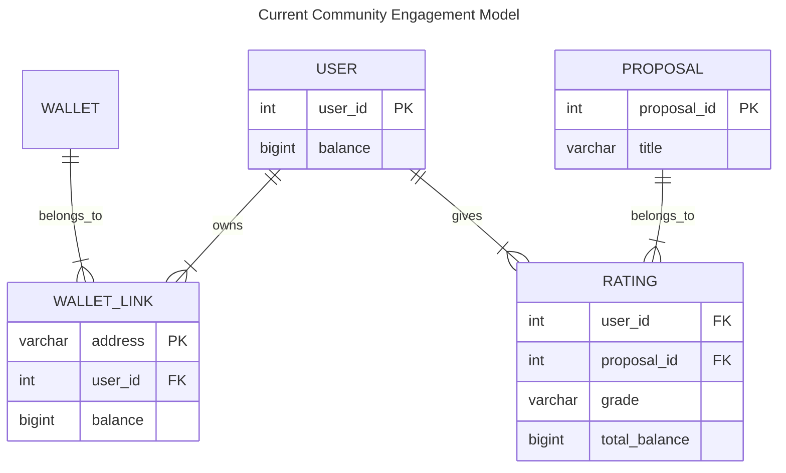
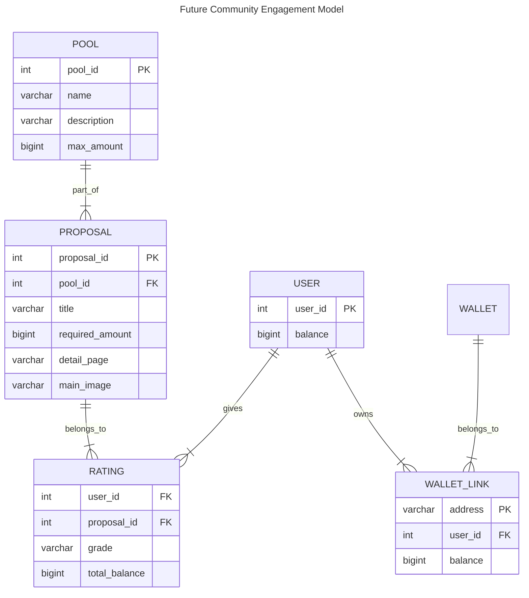

# Community Engagement Score

# System Overview

    
    

        System context overview - <a target="__blank" href="docs/images/system_overview.drawio">source</a>
    

# Project Structure
* The model structure is inspired by dbt's [How we structure our dbt projects](https://docs.getdbt.com/best-practices/how-we-structure/1-guide-overview) article.

# Data Model
Data model using [Crow's_foot_notation](https://en.wikipedia.org/wiki/Entity%E2%80%93relationship_model#Crow's_foot_notation)

* **users.csv** (collections) - user in the voting portal
* **wallet-links.csv** - [join table] between user and wallet
* **answers.csv** (voting-portal) - [join table] contains answers (ratings) of questions
* **questions.csv** - proposal names

# Square Root Voting Formula:
Formula used in the report task `make report` to calculate the average grade of a proposal (see `report.sql`).

$\text{Average Grade} = \frac{\sum (\sqrt{\text{tokens}_i} \times \text{grade}_i)}{\sum \sqrt{\text{tokens}_i}}$

Where:
* $tokens_i$: Number of tokens held by user $i$.
* $grade_i$: Grade assigned by user $i$
