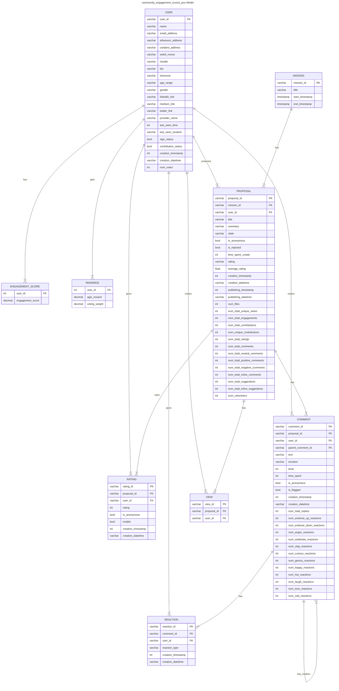

# Legacy Data Model fo [CES POC](../community_engagement_scores_poc/README.md)
Data model using [Crow's_foot_notation](https://en.wikipedia.org/wiki/Entity%E2%80%93relationship_model#Crow's_foot_notation)

