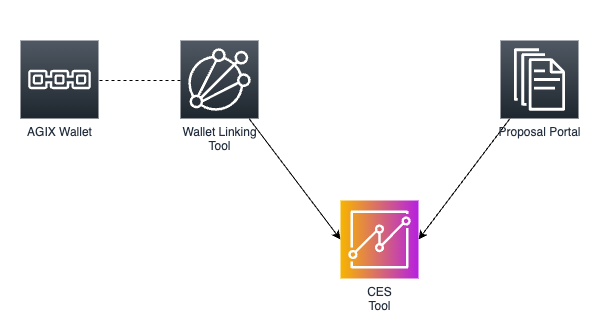
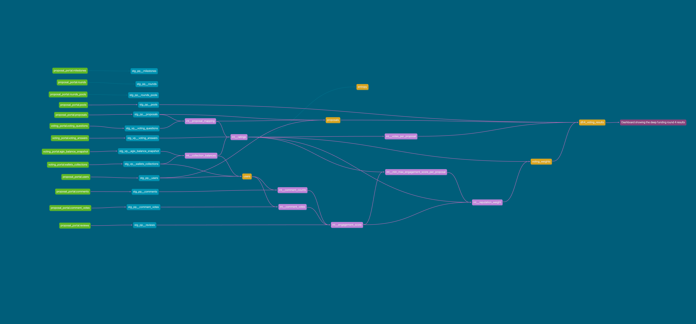

# Community Engagement Score Tool

The Community Engagement Score (CES) project, initiated by SingularityNET’s Deep Funding program, is an effort aimed at transforming the way community engagement and decision-making are approached within the ecosystem. The tool uses the data of the [Proposal Portal](https://proposals.deepfunding.ai/) and the Wallet Linking Tool to calculate the community engagement score to evaluate proposals in funding rounds. The CES is a metric that quantifies the level of engagement of a community member within the ecosystem. The CES is calculated based on the user’s activity on the Proposal Portal, such as rating proposals, commenting on proposals, and reacting to comments.

As part of the project, two versions of the CES tool prototypes were developed:

1. **dbt_prototype**: CES tool leveraging [data build tool (dbt)](https://www.getdbt.com/) to be integrated in an automated (not yet automated) pipeline to generate interactive reports and the funding round results. Furthermore, the tool provides an interactive component using [evidence.dev](https://evidence.dev/) to explore the data and the CES of the proposals.
1. **[DEPRECATED]** **sql_prototype**: CES tool using streamlit to build an interactive tool to calculate the CES of the proposals and explore the underlying data.

To start your journey with the CES tool, start in [dbt_prototype](./dbt_prototype/README.md).

# System Overview

The following diagram gives a broad overview of the system context of the CES tool.

    
    

        System context overview - <a target="__blank" href="docs/images/system_overview.drawio">source</a>
    

An up-to-date overview of the data model can be explored in the dbt documentation server by running `make docs` in the `/dbt_prototype` directory. An example of the data model is shown below.

    
    

        dbt data model
    

