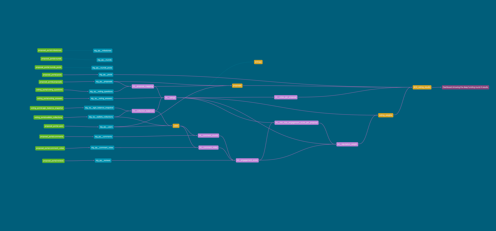

Welcome to CES dbt Tool!

### Using the dbt project

From the `dbt_prototype` directory, you find the most useful commands for dbt in the [Makefile](../makefile).

The project structure is based on the offical [dbt - How we structure our dbt projects](https://docs.getdbt.com/best-practices/how-we-structure/1-guide-overview), so you'll find the following directories:
```
dbt/
├── macros/           # Macros
├── models/           # Models
|   ├── staging/      # Staging models (loaded from raw data)
|   ├── intermediate/ # Intermediate models (loaded from staging models)
|   └── mart/         # Final models (loaded from intermediate models)
├── snapshots/        # Snapshots
└── tests/            # Tests
```

To make yourselve familiar with the dbt project start the dbt documentation server `make docs` and explore the data model as shown below.

<div align="center" style="background-color:white">
    
    <p>
        dbt data model
    </p>
</div>

### Resources:
- Learn more about dbt [in the docs](https://docs.getdbt.com/docs/introduction)
- Check out [Discourse](https://discourse.getdbt.com/) for commonly asked questions and answers
- Join the [chat](https://community.getdbt.com/) on Slack for live discussions and support
- Find [dbt events](https://events.getdbt.com) near you
- Check out [the blog](https://blog.getdbt.com/) for the latest news on dbt's development and best practices
